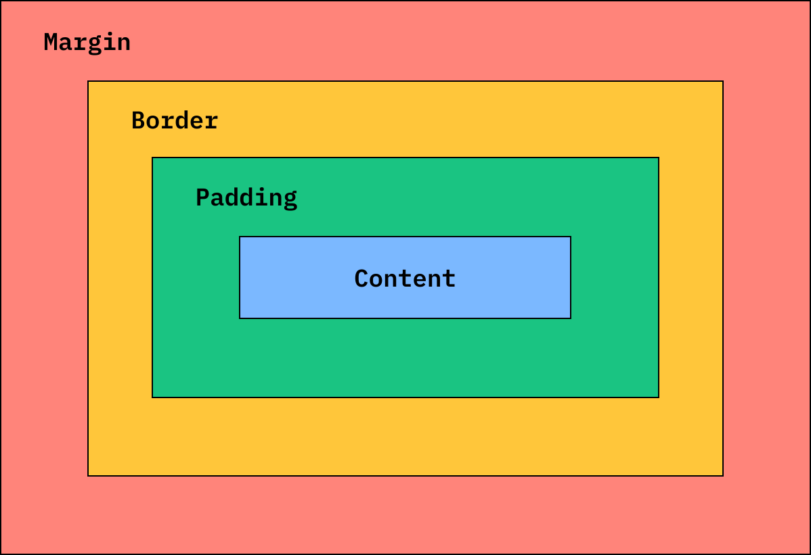
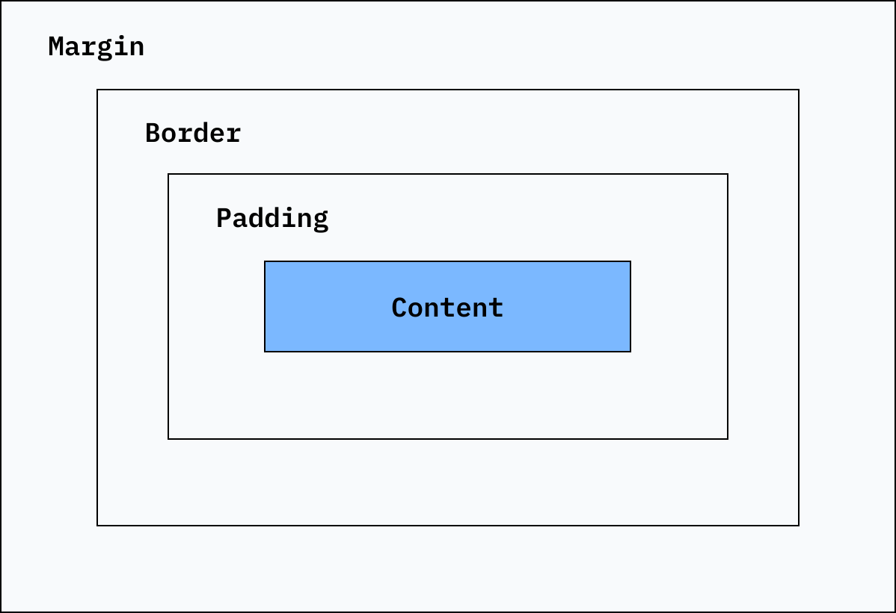
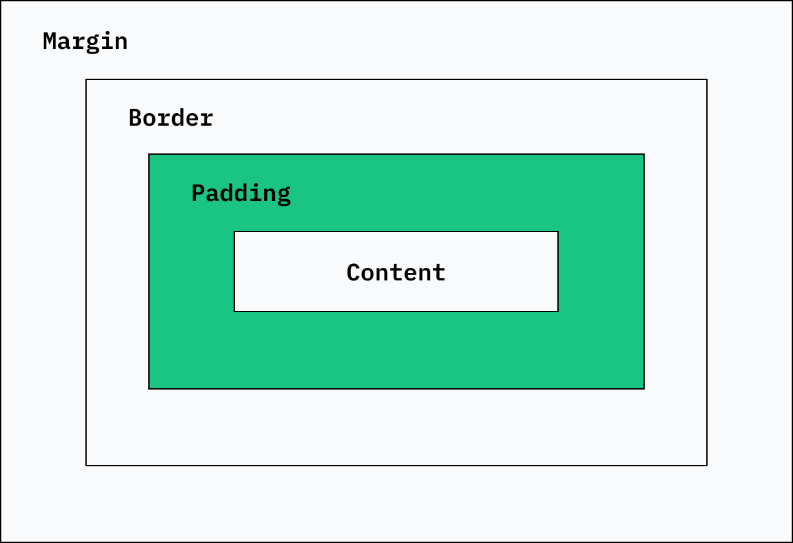
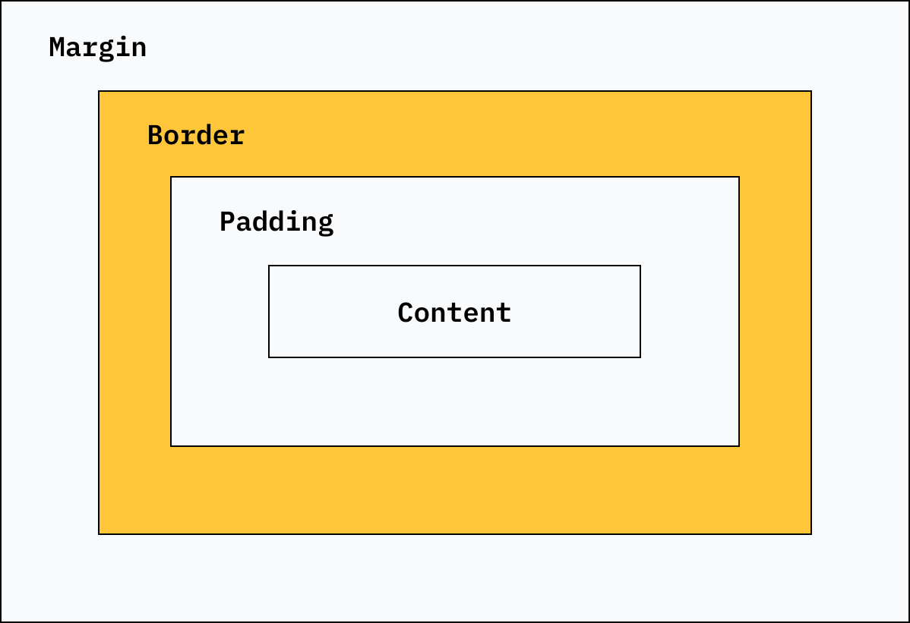
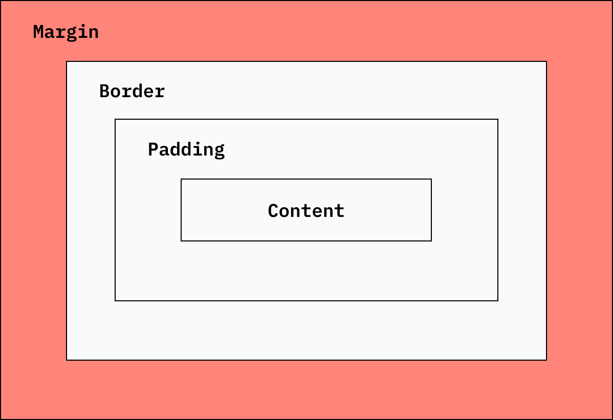
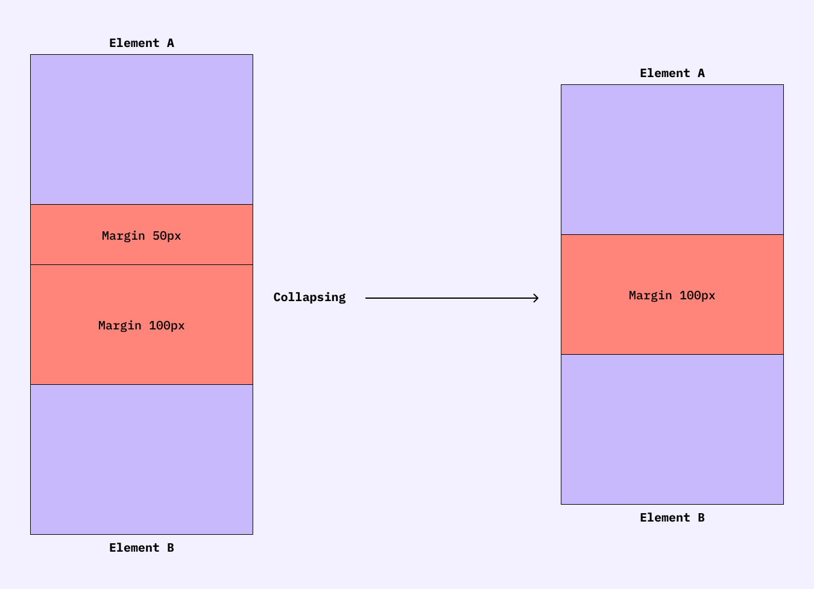
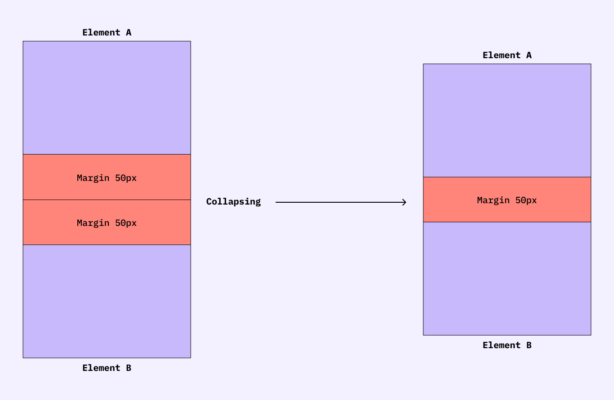

<nav class="toc">
  <ol>
    <li><a href="#css-box-model">CSS Box Model</a></li>
    <li class="lvl-2"><a href="#content-box-overview">Content Box</a></li>
    <li class="lvl-2"><a href="#padding-box-overview">Padding Box</a></li>
    <li class="lvl-2"><a href="#border-box-overview">Border Box</a></li>
    <li class="lvl-2"><a href="#margin-box-overview">Margin Box</a></li>
    <li class="lvl-2"><a href="#summary-of-differences">Summary of differences</a></li>
    <li><a href="#margin-collapsing">Margin collapsing</a></li>
    <li class="lvl-2"><a href="#collapsing-behavior">Collapsing behavior</a></li>
    <li class="lvl-2"><a href="#parent-dominance">Parent dominance</a></li>
    <li class="lvl-2"><a href="#negative-values">Negative values</a></li>
    <li><a href="#box-sizing">Box Sizing</a></li>
    <li class="lvl-2"><a href="#content-box">Content-Box</a></li>
    <li class="lvl-2"><a href="#border-box">Border-Box</a></li>
    <li><a href="#box-model-settings">Box model settings</a></li>
    <li><a href="#takeaway">Takeaway</a></li>
    </li>
  </ol>
</nav>
<figure class="post__intro">

<figcaption><a href="https://www.thoughtco.com/piet-mondrian-biography-4171786" tabindex="-1">Life and Work of Piet Mondrian</a></figcaption>
</figure>

When laying out a document, the browser's rendering engine represents each element as a rectangular box according to the standard CSS Box Model. How does it work?

<h2 id="css-box-model">CSS Box Model</h2>

The basis of content distribution on the web is rooted in the box model. These rectangular boxes are generated for all web page's content elements in the <a href="https://developer.mozilla.org/en-US/docs/Web/API/Document_object_model/Using_the_Document_Object_Model#what_is_a_dom_tree" >Document Object Model (DOM)</a> tree.

<figure>
  
  <figcaption>Visual representation and structure of the CSS Box Model as understood by the browser, which includes the content, padding, border and margin areas.</figcaption>
</figure>

Every HTML element in a Web document we use for creating content is a rectangle (or a box) and consists of four parts - <code>content</code>, <code>padding</code>, <code>border</code> and <code>margin</code>.

These areas are always part of every element, even if they are not defined in the style sheet (in which case they have either a value of zero or no value). This is how we can imagine every visible element.

<figure>
  
  <figcaption>Each HTML element consists of a Box Model, which has various properties that we can change in CSS.</figcaption>
</figure>

Each area (except <code>content</code>) has all four sides defined, so it is possible to manipulate them individually; content only has <code>width</code> and <code>height</code>.

<h3 id="content-box-overview">Content box</h3>

The content of the element (as well as the  <code>border</code> and <code>padding</code>) is located inside each HTML element. It's the area where your content is displayed. It can be a text, an <code>image</code>, a <code>video</code>, or any other element in a document.

<figure>
  
</figure>

The content box is the area that the content lives in.

<pre class="language-markup" tabindex="-1">
<code class="language-markup">

</code>
</pre>

The <code>content</code> CSS property replaces an element with a generated value, which  means that it <strong>can be manipulated by pseudo-elements</strong>. We can change the size using properties such as <code>inline-size</code> and <code>block-size</code> or <code>width</code> and <code>height</code>.

  See the Pen <a href="https://codepen.io/ondrejko/pen/poQENjp">
  How the CSS box model works - Padding Example</a> by Ondřej Konečný (<a href="https://codepen.io/ondrejko">@ondrejko</a>)
  on <a href="https://codepen.io">CodePen</a>.

<h3 id="padding-box-overview">Padding box</h3>

Padding adds extra space between the content area and its border. It has the same background as the content itself.

<figure>
  
</figure>

Padding has many notations that we can use.

<pre class="language-css" tabindex="-1">
<code class="language-css">
p { padding: 0;}
p { padding: 10rem 20% 30vmin 40ex;}
p { padding-left: 10em;}
p { padding-top: 20vw;}
p { padding-inline-start: 10ch;}
p { padding-block-end: 10mm;}
</code>
</pre>

We can change the values using <code>padding</code> and related properties such as <code>padding-inline-start</code> or <code>padding-block-end</code>. The <code>padding</code> property is, therefore, an <strong>indentation inside the element</strong> itself and sets the padding area on all four sides of an element at once.

  See the Pen <a href="https://codepen.io/ondrejko/pen/VwVKKxR">
  How the CSS box model works - Padding Example</a> by Ondřej Konečný (<a href="https://codepen.io/ondrejko">@ondrejko</a>)
  on <a href="https://codepen.io">CodePen</a>.

<h3 id="border-box-overview">Border box</h3>

The element's border is located between the area of the inner edge (<code>padding</code>) and the outer edge (<code>margin</code>). Its appearance <strong>can be adjusted</strong> according to the designer's preferences.

<figure>
  
</figure>

The border also has many definitions which can change its appearance.

<pre class="language-css" tabindex="-1">
<code class="language-css">
border: 0.5rem outset pink;
border: 4mm ridge rgba(211, 220, 50, .6);
border-width: 5pt dashed #ffcc00;
border-left-width: 4em;
border-bottom-style: none;
border-right-color: oklch(59.69% 0.156 49.77 / .5);
</code>
</pre>

The border-box property is used to frame an element visually. Its color, size, and style can be controlled using <code>border</code> and related properties such as <code>border-color</code>, <code>border-width</code> or <code>border-style</code>.

  See the Pen <a href="https://codepen.io/ondrejko/pen/xxQEEoQ">
  How the CSS box model works - Border Example</a> by Ondřej Konečný (<a href="https://codepen.io/ondrejko">@ondrejko</a>)
  on <a href="https://codepen.io">CodePen</a>.

<h3 id="margin-box-overview">Margin box</h3>

The area of the outer margin expands the space around the element outside the border. This empty space separates one element from another.

<figure>
  
</figure>

The margin also <strong>offers several options</strong> for manipulating the layout.

<pre class="language-css" tabindex="-1">
<code class="language-css">
margin: -3px;
margin: 5% auto;
margin: 2px 1.6em 0 auto;
margin-block-start: 10px;
margin-inline-start: revert-layer;
margin-inline: 20ch -40vh;
</code>
</pre>

  See the Pen <a href="https://codepen.io/ondrejko/pen/YzRGREx">
  How the CSS box model works - Padding Example</a> by Ondřej Konečný (<a href="https://codepen.io/ondrejko">@ondrejko</a>)
  on <a href="https://codepen.io">CodePen</a>.

<h3 id="summary-of-differences">Summary of differences</h3>

The <strong>content</strong> and <strong>border</strong> areas are rarely confused. The former is the content of the element and the latter is its boundary. However, there is often a misunderstanding regarding the use of inner and outer indentation.

Both properties (<code>padding</code> and <code>margin</code>) create empty space around the content of the elements which is why it is easy to confuse them or disregard the differences in their behavior. The difference is in the way gaps are created and used.

Let's take a look at the three most important takeaways:

<table>
<thead>
<tr>
  <th>Padding</th>
  <th>Margin</th>
</tr>
</thead>
<tbody>
<tr>
  <td>Padding is the inner space of an element.</td>
  <td>Margin is the outer space of an element.</td>
</tr>
<tr>
  <td>The styling of an element affects the padding.</td>
  <td>The styling of an element does not affect the margin.</td>
</tr>
<tr>
  <td>It does not allow negative values.</td>
  <td>It can have negative values.</td>
</tr>
</tbody>
</table>

If you need help distinguishing these areas, <a href="https://web.dev/learn/css/box-model/#a-useful-analogy">check out this handy analogy</a> by <a href="https://una.im/">Una Kravets</a>.

Margin has two specific behaviors. Firstly, it is possible to use negative values; secondly, its vertical values merge in certain cases. This atypical behavior is called <strong>margin collapsing</strong>.

<h2 id="margin-collapsing">Margin collapsing</h2>

Let's define when this atypical behavior occurs. The outer edges of two elements merge if the following conditions are met:

<ol>
  <li>Both elements are <a href="https://www.w3.org/TR/CSS22/visuren.html#block-boxes">block elements</a>.</li>
  <li>The merging elements are either top or bottom margins; merging does not apply to <code>margin-left</code> and <code>margin-right</code>.</li>
  <li>The elements are at the same level of the DOM structure and there is no separating content between them.</li>
  <li>The elements are in a parent-child relationship with an internal indentation or boundary defined.</li>
  <li>The <code>float</code> property is not applied to the element.</li>
  <li>Elements do not have an <code>absolute</code> positioning set.</li>
</ol>

You can find an even more detailed description <a href="https://developer.mozilla.org/en-US/docs/Web/CSS/CSS_Box_Model/Mastering_margin_collapsing">on the MDN page</a>.

<h3 id="collapsing-behavior">Collapsing behavior</h3>

Merging makes it easy to define vertical margins for multiple consecutive elements in the content.

This behavior is useful, for example, when designing a blog article containing various elements for which we want to have a unified indent. <code>figures</code>, <code>tables</code>, <code>headings</code>, <code>paragraphs</code>, and other elements can have the same outer indent, regardless of the order in which they appear. As a result, we don't have to define offsets for each combination.

The edges merge when two vertical edges (top and bottom) come into contact. When the merge occurs, only the larger indent value is applied. Think of it as a duel of two outer edges, where <strong>the bigger one wins</strong>.

<figure>
  
</figure>

If the offset values are the same for both of the elements, only one remains, or both values merge into one.

<figure>
  
</figure>
<h3 id="parent-dominance">Parent dominance</h3>

Merging also occurs for elements when their parent element has a defined outer edge in the vertical direction as well as elements inside. In this case, however, it depends on what properties the elements inside have.

If the elements inside the parent element have a <code>padding</code> or <code>border</code> property set, the <code>margin</code> will not be merged.

Take a look at the example and try to explore what happens, when all nested elements have an internal offset.

  See the Pen <a href="https://codepen.io/ondrejko/pen/mdEGwMr">
  Box Model: Collapsing Margins - Parents and Children Comparison</a> by Ondřej Konečný (<a href="https://codepen.io/ondrejko">@ondrejko</a>)
  on <a href="https://codepen.io">CodePen</a>.

<h3 id="negative-values">Negative values</h3>

Merging works the same for negative outer offset values. It just needs to be carefully calculated.

If one outer offset value is negative, it is subtracted from the positive value. Therefore, if a <code>margin-bottom</code> is set to <code>-50px</code> followed by an element with a <code>margin-top</code> of <code>100px</code>, the resulting value of the offset will be <code>50px</code> after merging.

  See the Pen <a href="https://codepen.io/ondrejko/pen/QWEVgMQ">
  Box Model: Collapsing Margins - Vertical and Negative</a> by Ondřej Konečný (<a href="https://codepen.io/ondrejko">@ondrejko</a>)
  on <a href="https://codepen.io">CodePen</a>.

The same principle applies when we combine two negative offsets. Again, the higher (in this case more "negative") value applies after the merger.

<h2 id="box-sizing">Box Sizing</h2>

To further complicate things, the sizes of individual Box Model areas are calculated differently. How does it work?

The <code>box-sizing</code>, a property that defines how the <code>width</code> and <code>height</code> of an element are calculated, is set to <code>content-box</code> by default in browsers. However, there is another value that changes the behavior of the element size calculation: <code>border-box</code>. Historically, the <code>padding-box</code> value also appeared in the specification, but it has since been removed and no longer exists in today's specification. It calculated box size by summing the content and padding areas without a border.

<h3 id="content-box">Content-Box</h3>

The width and height calculation of an element is given by the sum of the <code>content</code>, <code>padding</code>, and <code>border</code> areas. The margin property does not affect the resulting size of individual elements.

This means that if the width and height of the element are set, the values of the padding and border properties will expand the total size of the box by the sum of their values. This behavior corresponds to the CSS setting of <code>box-sizing: content-box</code> property.

  See the Pen <a href="https://codepen.io/ondrejko/pen/wvWEeee">
  Box Model: Content-Box</a> by Ondřej Konečný (<a href="https://codepen.io/ondrejko">@ondrejko</a>)
  on <a href="https://codepen.io">CodePen</a>.

<h3 id="border-box">Border-Box</h3>

For this type of model, the defined width and height are equal to the resulting box size, regardless of the values of the <code>padding</code> or <code>border</code> properties. Again, the <code>margin</code> property does not affect the resulting size of the element. This behavior corresponds to the CSS setting of <code>box-sizing: border-box</code> property.

  See the Pen <a href="https://codepen.io/ondrejko/pen/OJXogxm">
  Box Model: Border-Box</a> by Ondřej Konečný (<a href="https://codepen.io/ondrejko">@ondrejko</a>)
  on <a href="https://codepen.io">CodePen</a>.

<h2 id="box-model-settings">Box model settings</h2>

Setting up a single box model for all elements is currently the best possible solution. There is a simple explanation for this. All elements on the site are handled the same, so their behavior is consistent throughout the document.

In addition, web design tools work with the same elements, making it easier for the designer and coder to collaborate. Decorations such as frames do not affect the defined dimensions of the elements, and the elements on the resulting site should behave in the same way.

It is recommended to set the <code>box-sizing</code> property to <code>border-box</code>. This is straightforward and intuitive, but we must set it manually in the font because the <code>content-box</code> is still the default value for backward compatibility.

However, there are exceptions when it is recommended to set the <code>content-box</code> value for the <code>box-sizing</code> property. For relative or absolute positioning, this setting ensures that the positioning setting values are relative to the content, and independent of frame or indent changes.

The following rule has thus been added to the basic style, which is now a common practice.

<pre class="language-css" tabindex="-1">
<code class="language-css">
*, *::before, *::after {
  box-sizing: border-box;
}
</code>
</pre>

Jon Neal <a href="https://blog.teamtreehouse.com/box-sizing-secret-simple-css-layouts">came up with another viable alternative</a>. Instead of resetting the <code>box-sizing</code> property on the <code>border-box</code> for all elements, it only sets it to the document’s root element. For other elements, it uses the <code>inherit</code> value, which allows the <code>box-sizing</code> property to inherit:

<pre class="language-css" tabindex="-1">
<code class="language-css">
html {
  box-sizing: border-box;
}
*, *::before, *::after {
  box-sizing: inherit;
}
</code>
</pre>

This can be useful when designing a component that assumes the default </code>box-sizing: content-box</code> behavior, and elements embedded inside. It can prevent unwanted breakage of nested components.

<h2 id="takeaway">Takeaway</h2>

The behavior of the CSS Box Model can be confusing due to its evolution. This is evidenced by the fact that <a href="https://css-tricks.com/international-box-sizing-awareness-day/">International Box-Sizing Awareness Day</a> was established on <strong>February 1st</strong>.

Due to backward compatibility, default browser settings have the <code>box-sizing</code> property set to <code>content-box</code>, even though the vast majority today use the <code>border-box</code> value. Therefore, we should remember to define the behavior of the box model in our CSS styles and understand the differences between these values.

It is up to each individual whether they want to use one calculation method or the other. What is crucial is to understand the core principles.
