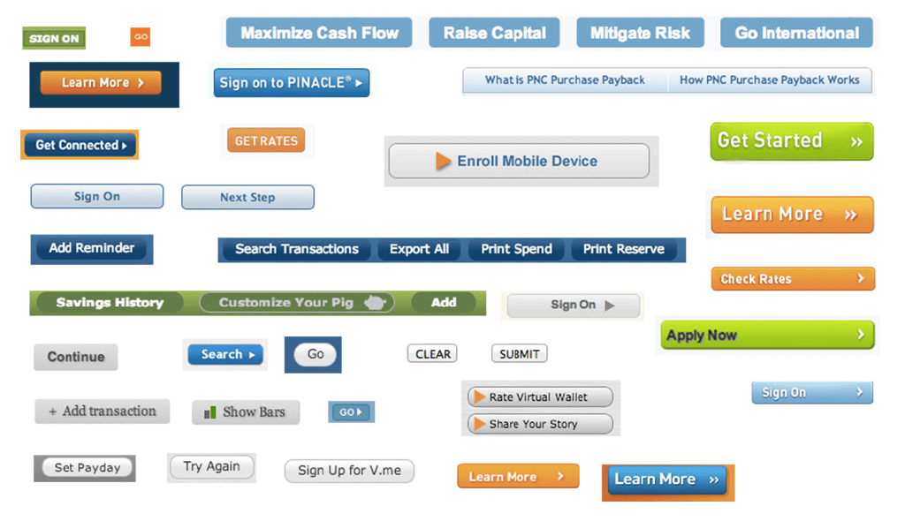
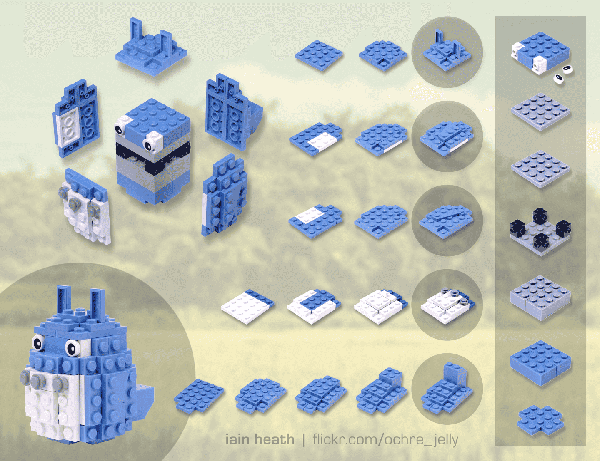
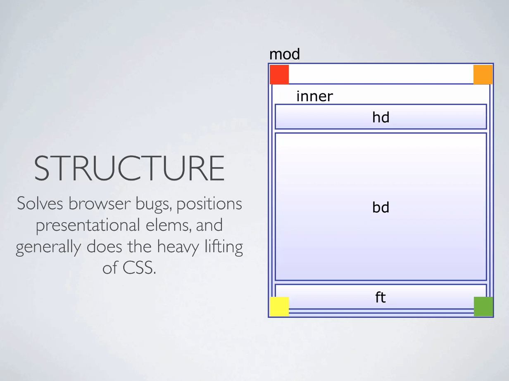

<figure>

It's 2023 and we have a lot of methods and techniques that make CSS writing better and easier. However, there is one method that was one of the first to tackle object-oriented CSS writing and lay a solid foundation for other frameworks that followed.

This method is called [Object Oriented CSS](http://oocss.org/) (OOCSS) and, in this article, I will describe the basic principles and ideas of this methodology.

## Introduction

In 2008, Nicole Sullivan borrowed the concept of object-oriented design to provide structure to CSS. She presented her Object Oriented CSS (OOCSS) concept at [Web Directions North](https://www.slideshare.net/stubbornella/object-oriented-css) to the world.

The main idea behind [OOCSS](https://github.com/stubbornella/oocss/wiki/) is to treat page elements as objects, assign classes to these objects, treat these classes as single entities in style sheets, and reuse them when necessary.

> Object Oriented CSS is a methodology or framework (whichever you prefer) for organizing and extending your CSS in a way that is lightweight, highly performant, and easily used by developers at all skill levels.

## Basic principles

The idea of OOCSS is timeless. [Nicole Sullivan](http://www.stubbornella.org/content/) started with the approach we use today when we create design systems. Take a look at [Nicole's presentation](https://www.slideshare.net/stubbornella/our-best-practices-are-killing-us) where she analyzes the websites of large companies such as Facebook and Salesforce and points out stylistic inconsistencies in their interfaces.

This approach might have also inspired web designer [Brad Frost](https://bradfrost.com/) when he introduced the [interface inventory](https://bradfrost.com/blog/post/interface-inventory/) method, which is based on similar principles but in a wider context and without reference to technology.


*PNC bank has many button styles as Brad Frost described in his article “[Interface inventory](https://bradfrost.com/blog/post/interface-inventory/)”.*

The issue of inconsistent interfaces continues to be addressed today and will probably never be completely solved because there will still be new challenges and problems.

Although we already know how important it is to monitor consistency of the interfaces, we are still figuring out how to do it properly. This is also the reason why we build [design systems](../blog/the-basic-structure-of-design-systems).


*We often associate this mental model with LEGO bricks.*

However, this is an issue we need to solve if we want to improve the quality of our interfaces, save development costs, and speed up the entire design process.
Nicole Sullivan had the same goal and her work took CSS writing a step further. Let's take a look at the principles of her framework.
This methodology defines a CSS object as a visual pattern that can be used throughout the site. It serves as a guideline when designing reusable code that is scalable, sustainable and easy to use. There are two main principles of OOCSS:

1. Separation of structure and skin
2. Separation of container and content

## Separation of structure and skin

*Structure* is the basic core element which is *invisible*. These are the recurring elements that make up various page layouts and are not expected to change significantly over time. This includes properties such as `width`, `height`, `padding`, `margin`, `overflow`, etc.


*Picture from presentation “[What is Object Oriented CSS?](https://www.slideshare.net/stubbornella/what-is-object-oriented-css)”*

*Skin* is a decorative part and it's about everything related to the brand of the site. It is bits and pieces that make your website different from the competition. You can think about properties like colors, borders, typography, shadows, gradients etc.
Skin, on the other hand, is the decorative part and it's about everything related to the website’s brand. These are the little things that set your website apart from the competition. This includes properties like `color`, `border`, `font-size`, `box-shadow`, `background`, etc.


*Picture from presentation “[What is Object Oriented CSS?](https://www.slideshare.net/stubbornella/what-is-object-oriented-css)”*

Take a look at the following CSS and focus on repeating styles.

```css
.button-primary {

  /* Repeating styles */
  display: inline-block;
  padding: 16px 32px;
  margin-bottom: 0;
  font-size: 18px;
  line-height: 32px;
  text-align: center;
  cursor: pointer;

  /* Decorative part */
  color: white;
  background: black;
  border: 0;
}
.button-secondary {

  /* Repeating styles */
  display: inline-block;
  padding: 16px 32px;
  margin-bottom: 0;
  font-size: 18px;
  line-height: 32px;
  text-align: center;
  cursor: pointer;

  /* Decorative part */
  color: black;
  background: white;
  border: 1px solid black;
}
```

We can use the following HTML for this stylesheet.

```html
<button class="button-primary">Button</button>
<button class="button-secondary">Button</button>
```

In this example, we are styling two buttons. If you look at the code carefully, you will notice a significant amount of repetition. This can clutter your stylesheet over time and lead to potential inconsistencies.

Based on the concept of OOCSS, you can abstract the above CSS into structures and skins.

<div class="code-example">
<p class="codepen" data-height="600" data-default-tab="result" data-slug-hash="GRYQYPe" data-user="ondrejko">
  <span>See the Pen <a href="https://codepen.io/ondrejko/pen/GRYQYPe">
  OOCSS - Without using the object oriented approach </a> by Ondřej Konečný (<a href="https://codepen.io/ondrejko">@ondrejko</a>)
  on <a href="https://codepen.io">CodePen</a>.</span>

<script async src="https://cpwebassets.codepen.io/assets/embed/ei.js"></script>
</div>

By separating them, we can reuse the classes and change their appearance by using another class for skin. Here is the refactored CSS according to the OOCSS principle.

```css

/* Repeating styles for button */
.button {
  display: inline-block;
  padding: 16px 32px;
  margin-bottom: 0;
  font-size: 18px;
  line-height: 32px;
  text-align: center;
  cursor: pointer;
}

/* Decorative parts - visual variants */
.button-primary {
  color: white;
  background: black;
  border: 0;
}
.button-secondary {
  color: black;
  background: white;
  border: 1px solid black;
}
```

Then we can use the following HTML (notice how classes are used to change the appearance).
```html
<button class="button button-primary">Button</button>
<button class="button button-secondary">Button</button>
```

This way, we can save code, use modularity, and easily create other variants. If we decide to increase the `font-size` of the `button`, we can do it in one place and change all the buttons at once.

<div class="code-example">
<p class="codepen" data-height="600" data-default-tab="result" data-slug-hash="GRYQYba" data-user="ondrejko">
  <span>See the Pen <a href="https://codepen.io/ondrejko/pen/GRYQYba">
  OOCSS - Separate structure and skin</a> by Ondřej Konečný (<a href="https://codepen.io/ondrejko">@ondrejko</a>)
  on <a href="https://codepen.io">CodePen</a>.</span>

<script async src="https://cpwebassets.codepen.io/assets/embed/ei.js"></script>
</div>

## Separation of container and content

We should avoid writing styles that are location-dependent. The main motivation is that objects should look the same regardless of their location.

Content refers to objects such as media, images, paragraphs, which are nested inside other elements that serve as *containers*.

Styles used for *content* objects (elements) should be independent of the container class, allowing them to be used independently of their parent objects (elements). Take a look at the following example.

```css
.widget {
  /* foo */
}
.widget .list {
  /* foo */
}
.widget .list .title {
  /* foo */
}
.widget .list .content {
  /* foo */
}
```

Now, let's separate the content from the container.

```css
.widget {
  /* foo */
}
.list {
  /* foo */
}
.list-title {
  /* foo */
}
.list-content {
  /* foo */
}
```

Now these classes can be used in many situations without the restriction of having a parent with the class `.widget` or `.list`.

Learning how to use this principle may take some time, but the reward is the ability to write better code.

## Takeaway

This method helps us think about styles in a more modular and object-oriented way. It also sets our mindset to write less repetitive code and helps us understand that extending selectors rarely leads to writing better code.

By trying to use or understand this methodology, you will gain a basic understanding of the issues related to the [specificity](https://developer.mozilla.org/en-US/docs/Web/CSS/Specificity) and selectors structure, and you will understand how fragile CSS is.

I recommend [checking out more](https://www.slideshare.net/stubbornella/presentations) of Nicole Sullivan's presentation resources.
