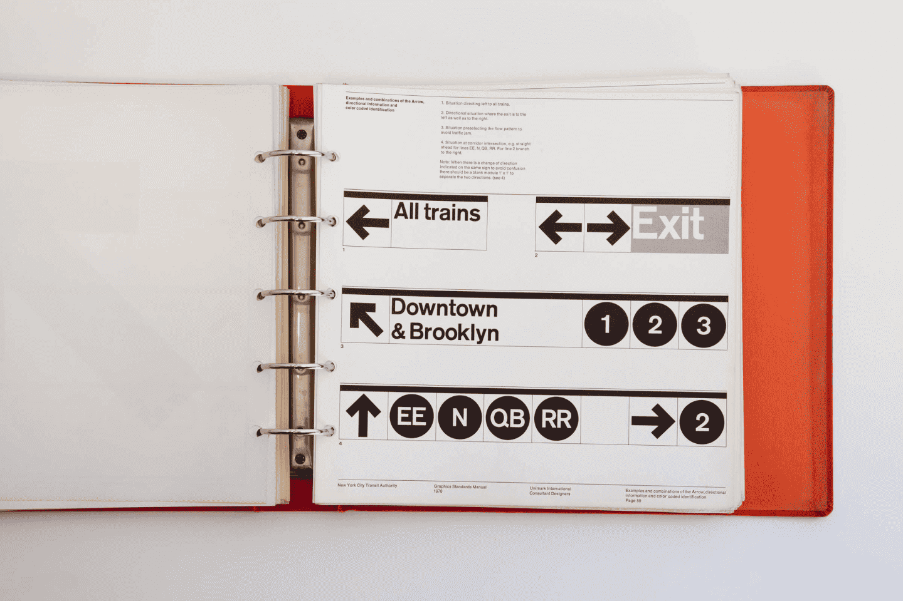

<figure class="post__intro">

<figcaption>First Edition Of The New York City Transit Authority Graphics Standards Manual</figcaption>
</figure>

Design Systems are a set of standards for service design management. They aim to reduce redundancy in creating a shared language and achieve better communication and visual consistency across products through reusable components and designs.

<h2 id="history">History</h2>

Looking back at the Bauhaus and Swiss designs, we can see some clues about what we now call a design system. The Bauhaus (1919-1933) revolves around the idea that "form follows function." The idea is that the primary aspect is functional simplicity without decorative elements.

<figure>
  
  <figcaption>
    Bauhaus Art School, 1919-1933
  </figcaption>
</figure>

This means that all parts of the page must have functions that focus on proportions, color theory, and working with the grid. Swiss Style, also known as International Typographic Style (1950s and 1960s), has taken the grid a step further and focused on asymmetry and clean sans serifs.

Both of these crucial periods in art history focus on a unified design language with instructions on how to work with each pattern or element that should be followed.

It was therefore a major influence on the development of modern graphic design, desktop publishing (a term for computer typesetting and, thus, the use of computer technology for word processing, images, etc.), and web design.

<h2 id="what-is-a-design-system">What is a design system?</h2>

A design system is a set of outputs from various design areas that are needed for consistent and sustainable creation. It constantly evolves with the product, tools, and technologies used. Their nature is that they embed design building blocks into teams and workflows to create consistent user experiences.

<figure>
  
  <figcaption>
    Picture from the article <a href="https://medium.com/productunicorn/design-systems-style-guides-all-those-libraries-what-the-hell-is-the-difference-4c2741193fdc" tabindex="-1">Jan Toman's article
</a>
  </figcaption>
</figure>

It is therefore the embodiment of a system of concepts with a clear structure and meaning, which are in one place and are mostly driven by the whole team.

What goes into a design system and how it is implemented can vary from company to company, depending on the size, experience, and needs of the product team.

If you are looking for inspiration, you might want to start with <a href="https://adele.uxpin.com/">the most well-known design systems</a> that their creators can rightfully be proud of.

<h2 id="why-have-a-design-system">Why have a design system?</h2>

A design system can serve as an educational tool. It is structured for both designers and developers to easily understand all available information, even if it takes time to teach others how to use it. Detailed user instructions and style guides are also suitable for new team members. Another considerable advantage is the visual consistency across products, departments, and teams.

<figure>
  
  <figcaption>
    Legacy interface components
  </figcaption>
</figure>

A design system provides a single source of components, patterns, and styles. It aims to unify designs to be visually coherent and fit into the corporate ecosystem.

Creating a common language across teams is one of the most significant benefits. A design system can also come in handy when there is a change of roles in the team.

<blockquote>
Design systems, when implemented well, can provide a lot of benefits to a design team.<cite> — <a href="https://theresefessenden.com/" tabindex="-1">Therese Fessenden</a></cite>
</blockquote>

The design system reduces the pressure on design resources, allowing everyone involved in the development process to focus on more relevant issues. Designers can use existing elements and patterns, and save time by not having to create new ones.

This makes it possible to create presentation designs more efficiently. It is most useful when a web service contains many individual screens or when working in a team of several designers.

<h2 id="why-not-have-a-design-system">When is not needed?</h2>

It is not always appropriate to put effort into creating design systems. According to <a href="https://medium.com/@nathanacurtis">Nathan Curtis</a> (who has long been involved in creating design systems), creating a user interface for a design system <a href="https://medium.com/eightshapes-llc/design-system-ui-is-more-expensive-than-a-product-teams-ui-f3c3e48c555">is more expensive than building a user interface</a> for a product team. Investing in such a robust system should result from careful consideration and planning.

For projects full of static, disposable creations, it may not be appropriate to use the same components across modules. Such web services do not benefit from a design system and if implemented, the result would be harmful and not worth all the costs associated with it.

<blockquote>
A system’s value is realized when products ship features that use a system’s parts.<cite> — <a href="https://medium.com/@nathanacurtis" tabindex="-1">Nathan Curtis</a></cite>
</blockquote>

Creating such a system is time-consuming and constantly evolving thanks to product team feedback. If you start with such an initiative, one of your tasks will be to convince people in leadership positions that <a href="https://www.smashingmagazine.com/2022/09/formula-roi-design-system/">investing in its creation is worth it</a> and how you want to achieve it.

<h2 id="what-is-inside-design-system">What is inside a design system?</h2>

Design systems come in many forms and vary according to the diversity of each product. Most of them include a style guide, a&nbsp;component library, and a pattern library.

In addition to tools for designers and developers, a design system should also include abstract elements such as corporate values, shared ways of working, thinking, and more.

It should also document information architecture, motion and animation work, content creation principles, an accessibility description, and other areas.

<figure>
  
</figure>

Such a system is not the output of individual or team work, but a set of outputs constantly evolving with the product, tools and new technologies. It is good to point out that a design system consists of tangible and intangible elements that need to be addressed.

In addition to a component library and definitions of basic visual elements, a design system includes standards and documentation. These describe how and why to use the individual parts of the proposals and for what purpose. This benefits not only the developers and designers, but also anyone involved.

<h3 id="style-guide">Style Guide</h3>

The style guide describes the lowest level of design abstraction. As the name suggests, it defines the appearance and focuses on graphic styles and their usage.

It contains definitions of colors and color palettes, fonts and typography, icons, guidelines for the use of shapes, guidelines for product branding, logo usage and placement. It can also describe handling punctuation, spelling, grammar, and other syntactical elements.

<figure>
  
  <figcaption>
    WeWork Styles Guide, presentation by <a href="https://gretelny.com/wework" tabindex="-1">Gretel design studio</a>
  </figcaption>
</figure>

The most common style guides focus on branding (colors, typography, logos, and print media). They also frequently offer instructions on writing content, using an effective tone, and describing visual and interactive standards.

<h3 id="component-library">Component library</h3>

A modern library of user interface components provides developers and designers with a wide range of building blocks. It organizes components into individual areas or groups and preferably includes the chosen methodology.

A component library should not only contain all reusable elements such as buttons, form elements, lists, headings, bookmarks, etc., but also more extensive components such as headers, grids, tabs, galleries, navigations, etc.

<figure>
  
  <figcaption>
  Example from <a href="https://component.gallery/components/" tabindex="-1">component.gallery</a>.
  </figcaption>
</figure>

The components contain visual examples of all variants, types, and states. In addition to the name and label, they should have attributes and variables (such as size, shape, and color), code usage examples, library information, and design usage examples.

They may also contain rules about usage in different situations, where they should not be used, and when it is better to choose another component.

<h3 id="pattern-library">Pattern library</h3>

The term pattern library is often confused with a component library, but there is a difference between these types of libraries. Component libraries specify individual user interface elements, while pattern libraries contain collections of groupings or layouts of user interface elements.

<figure>
  
  <figcaption>
    Login pattern in <a href="https://carbondesignsystem.com/patterns/login-pattern/"tabindex="-1">Carbon Design System</a></a>
  </figcaption>
</figure>

Pattern libraries are reusable combinations of components that solve a specific problem and help users achieve their goals and ensure consistency.

<blockquote>
Consistency is one of the most powerful usability principles: when things awlays behave the same, users don't have to guess what will happend.<cite> — <a href="https://www.nngroup.com/people/jakob-nielsen/" tabindex="-1">Jakob Nielsen</a></cite>
</blockquote>

Pattern libraries are usually less robust than component libraries, but are no less critical for design uniformity. They typically include content structure and layout options.

<h2 id="wrapping-up">Wrapping up</h2>

Design systems are helpful and save both time and money. They guide everyone involved in the development of digital products. To make it work well, we need experts who can not only design the system, but also further develop, maintain, and most importantly, improve it.

Creating such a system requires higher initial and operating costs for individuals and dedicated teams, and choosing to do so should always be considered carefully.

