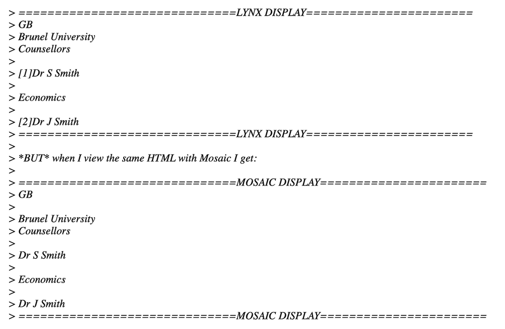
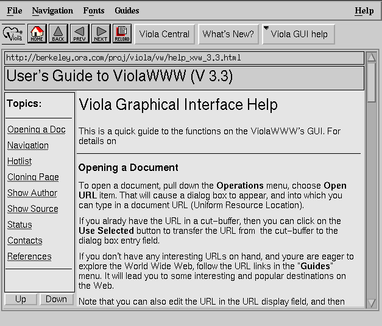
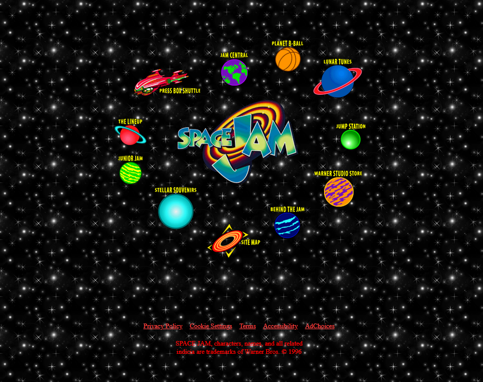
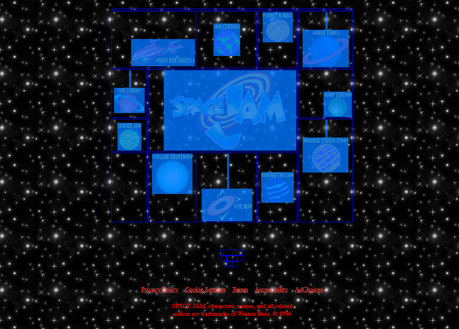
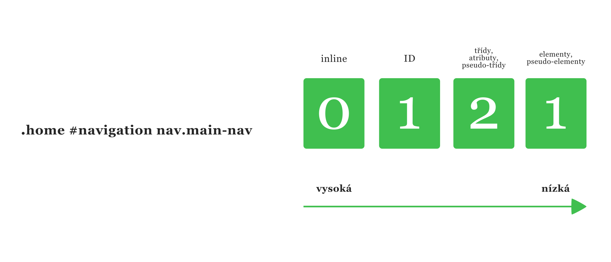
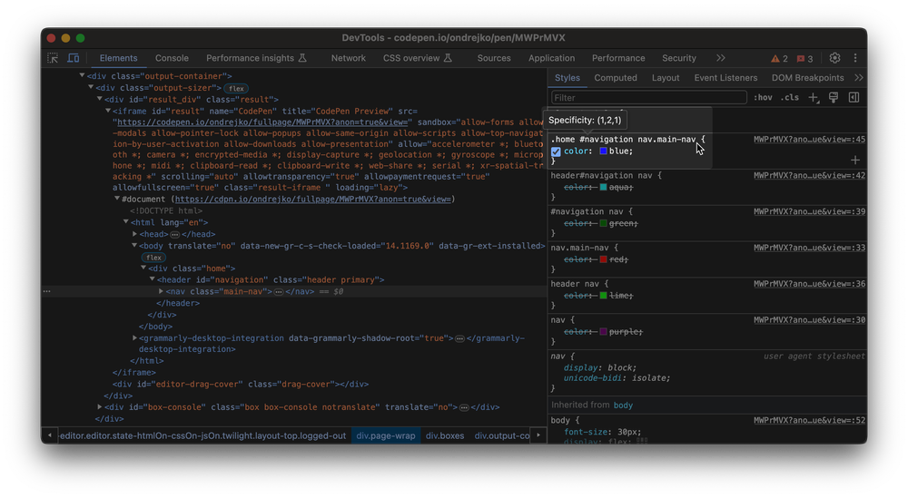
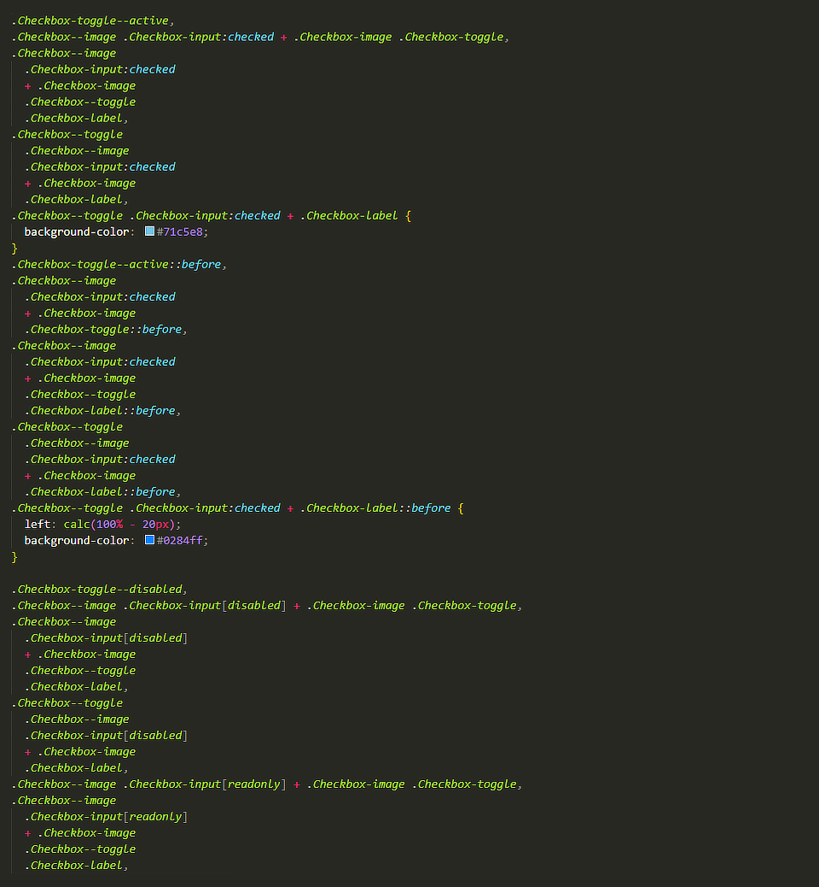

*Ever wonder what existed before CSS and what made styling web pages so cumbersome? Let's dive into the history and evolution of CSS.*

In 1994, [Håkon Wium Lie](https://www.wiumlie.no/) recognized the need for a language that would allow for the visual styling of web documents. The main idea was to separate content from presentation. This led to the creation of CSS, developed by Lie and other authors, and eventually adopted by all browsers. After HTML, CSS became the second standardized language for W3 (the World Wide Web). However, before we jump ahead, let's see how it all began.

As you can see below, browsers like Netscape and Mosaic displayed the same HTML differently. For example, Mosaic developers added a top margin to [unordered list](https://developer.mozilla.org/en-US/docs/Web/HTML/Element/ul), which was seen as an error by others who wanted more control over their content’s appearance.


 *An Archived Email Showing Different Interpretations of HTML – source:  [World Wide Web History Center](http://1997.webhistory.org/www.lists/www-talk.1994q1/0648.html).*

In the mid-90s, as web pages started to emerge, altering default browser settings was tricky. When cascading styles were still being tested, the only way to adjust the appearance was through HTML attributes. Early browsers like ViolaWWW barely allowed for visual customization.


*ViolaWWW — source: [Wikipedie](https://en.wikipedia.org/wiki/ViolaWWW)*
## Web Design Before CSS
Gradually, website creators started experimenting with what we know today as web design. A classic example is the Space Jam website from 1996.


*Space Jam, 1996 — source: [spacejam.com](https://www.spacejam.com/1996/)*

This website clearly shows how text and link color differentiation and layout design were approached during that time.

Back then, colors and layout were defined directly within the HTML using attributes like `bgcolor`, `text`, `link`, `vlink`, and `alink`.

```html
<body
  bgcolor="#000000"
  text="#ff0000"
  link="#ff4c4c"
  vlink="#ff4c4c"
  alink="#ff4c4c"
>
```

Another interesting example from this era is the layout of the website. Before, layouts were crafted using nested tables. This technique was the go-to method for web design for several years. Initially, designs like the circular layout on the Space Jam site were popular, followed by the  [Holy Grail Layout](https://alistapart.com/article/holygrail/), which dominated web design trends for a long time.

Table-based design is still recommended for creating newsletters and HTML-generated PDFs because many email clients haven’t updated their systems.

> Code newsletters like it’s still 1999.

This example shows how designers created the popular circular layout of the time. Companies used these early attempts at visual customization to stand out from the competition and move away from default settings.


*An example of the circular layout — source: [spacejam.com](https://www.spacejam.com/1996/)*

Images were placed within the circular layout using table attributes like `align` and `valign`, along with HTML tags like `<br>`.

```html
<table width=500 border=0>
  <tr>
    <td colspan=5 align=right valign=top></td>
  </tr>
  <tr>
    <td colspan=2 align=right valign=middle>
      <br>
      <br>
      <br>
      <center>
        <a href="cmp/pressbox/pressboxframes.html">
          
        </a>
      </center>
    </td>
  </tr>
</table>
```

For several years, this was the standard method for web design, although progressive developers who experimented with CSS adopted new techniques sooner.

## The Rise of CSS

CSS was a game-changer back then. In 1998,  [Eric Meyer](https://meyerweb.com/) and other developers [started documenting](https://meyerweb.com/eric/articles/webrev/199805.html?ref=ondrejkonecny.com) how to implement and use CSS styles. Over time, CSS made its way onto the first websites and became a staple for web design. Here's an example of how it was used in the past:

```css
<STYLE type=”text/css”>
  BODY {
    font-family: serif;
    background-color: silver;
  }
  H1 {
    font: x-large Verdana, sans-serif;
    color: olive;
    border-bottom: thin black solid;
  }
  .sidebar UL LI {
    list-style-type: none;
    margin-left: 0;
    margin-right: 0.5em;
  }
  .sidebar UL LI A {
    color: #ffcccc;
  }
  .body {
    background: white;
  }
  IMG.icon {
    border: outset gray 3px;
    padding: 0;
  }
</STYLE>
```

As more declarations, properties, and values were added, CSS became an essential language for web development.

Initially, it was revolutionary. Instead of changing attribute values on every page to alter a headline color, a single tweak in the CSS file would apply changes across the entire site.

Developers quickly adopted CSS, but nobody initially focused on organizing or maintaining styles. Writing CSS without any structure or sustainability plan soon proved inadequate. There were no best practices for maintaining stylesheets or dealing with the often inconsistent designs of large websites, leading to various complications...

> Two CSS properties walk into a bar.
> A barstool in a completely different bar falls over.

## Issues with CSS

What complications can arise when writing CSS? For beginners, styling can be particularly challenging. On one hand, CSS is straightforward and easy to understand. On the other hand, maintaining, modifying, and structuring styles can be quite complex. Various problems can crop up along the way.


*Frustrated programming — source: [giphy](https://media.giphy.com/media/v1.Y2lkPTc5MGI3NjExOHdneTdrZ2I3ZzkyMzJnYWMxdmhlZDE1b3g5MzB5aHFwZ2J6c3Z0diZlcD12MV9pbnRlcm5hbF9naWZfYnlfaWQmY3Q9Zw/yYSSBtDgbbRzq/giphy.gif)*
### Deep Nesting of Selectors and High Specificity

Let’s explore this issue with an example. Imagine a developer wants to add an *unordered list* to an existing project, with links in blue and a font size of `20px`. They choose the selector `.list`.

They add the HTML deep within the structure where it belongs:

```html
<ul class="list">
  <li><a href="first.html">Odkaz 1</a></li>
  <li><a href="second.html">Odkaz 2</a></li>
  <li><a href="third.html">Odkaz 3</a></li>
</ul>
```

And write CSS like this:

```css
.list li a {
  font-size: 20px;
  color: blue;
}
```

Oops! The links are red, the font is 16px, and they're bold. Checking DevTools reveals that another selector with higher specificity is overriding their styles:

```css
body #content .page ul li a {
  font-size: 16px;
  color: red;
  font-weight: bold;
}
```

So, what can the developer do? They can either increase the specificity of the new selector, adjust the existing one, or use `!important`. However, each solution has its drawbacks and underscores the ongoing struggle with CSS specificity.

Typically, developers avoid modifying existing selectors or using `!important`. Instead, they often increase the specificity by adding more to the selector, increasing the specificity by adding the list class to our unordered list selector:

```css
body #content .page ul.seznam li a {
  font-size: 20px;
  color: blue;
}
```

This approach, however, creates a new element that can't be reused elsewhere, requiring more code each time it's needed. Keeping specificity low from the start is crucial for maintainable CSS. In short, keeping specificity low right from the first line of code is essential.

### Calculating Specificity

In CSS, styles are applied based on their importance, with selectors assigned different values depending on their type.

The cascade assigns specificity to each rule; when two selectors target the same element, the one with higher specificity takes precedence.


*An Example of Calculating CSS Specificity — source: [frontend.garden](https://frontend.garden/clanky/vyvoj-efektivity-zapisu-css/)*

As developers, we sometimes make the mistake of targeting the same HTML element multiple times. We often increase specificity by adding or modifying selectors. While this works in the short term, it usually spirals out of control, leading to specificity issues.

Let's look at an example to see how selector specificity increases.

<p class="codepen" data-height="300" data-default-tab="html,result" data-slug-hash="MWPrMVX" data-user="ondrejko" style="height: 300px; box-sizing: border-box; display: flex; align-items: center; justify-content: center; border: 2px solid; margin: 1em 0; padding: 1em;">
  <span>See the Pen <a href="https://codepen.io/ondrejko/pen/MWPrMVX">
  Specificity rules examples</a> by Ondřej Konečný (<a href="https://codepen.io/ondrejko">@ondrejko</a>)
  on <a href="https://codepen.io">CodePen</a>.</span>
</p>
<script async src="https://cpwebassets.codepen.io/assets/embed/ei.js"></script>

Try selecting a navigation element in DevTools to see how other selectors are ignored.


*Viewing CSS Specificity Directly in DevTools by Hovering Over a Selector — source: [frontend.garden](https://frontend.garden/clanky/vyvoj-efektivity-zapisu-css/)*

### Nesting Hell

CSS developers used to miss out on many features offered by other programming languages, such as conditionals and loops. This gap led to the emergence of preprocessors like  [Sass](https://sass-lang.com/) and  [LESS](https://lesscss.org/) around 2005, making CSS coding more efficient. However, these tools also introduced new challenges, one of the most notorious being "Nesting Hell."

Preprocessors like Sass and LESS, and more recently [native CSS](https://developer.mozilla.org/en-US/docs/Web/CSS/CSS_nesting/Using_CSS_nesting) as of December 2023, allow for selector nesting. This feature lets you write multi-level rules in a few lines, eliminating the need to repeat multi-level rules. However, developers often overlook what preprocessors compile into the final CSS. Features like [@extend](https://sass-lang.com/documentation/at-rules/extend/) can generate a lot of extra code, [slowing download times](https://blogs.windows.com/msedgedev/2023/01/17/the-truth-about-css-selector-performance/).

Deciphering and editing such code can be nearly impossible in some cases. The following code example might look scary, but it's a common sight when refactoring CSS:

```css
.Checkbox--toggle {
  padding: $chekcbox-toggle-diameter / 10 0;
    .Checkbox {
      &-input {
        &:checked {
          & + .Checkbox-label {
            @extend .Checkbox-toggle — active;
          }
        }
      &:not(:checked) {
        &:focus {
          & + .Checkbox-label {
            &::before {
              background-color: $checkbox-toggle-active-handle-bg;
            }
          }
        }
      & + .Checkbox-label {
        background-color: rgba($checkbox-toggle-bg, 0.46);
      }
    &[disabled], &[readonly] {
      & + .Checkbox-label {
        @extend .Checkbox-toggle — disabled;
      }
    }
  }
  &-label {
    @extend .Checkbox-toggle;
  }
}
```

Wondering what the compiled selector would look like? I didn't dare share the final result of this particular selector, but the image below gives you a good idea of how complex these outputs can be.


*A Compiled CSS File from One of My Client's Projects*

It's best to avoid deep nesting of selectors. Aim to nest selectors no more than two levels deep, with rare exceptions for a third level. This keeps your code readable and saves you from endless headaches.

```css
.button {
  padding: 12px;
  background: blue;
  
  @include breakpoint(tablet) {
    padding: 8px;
  }
  
  &:hover {
    background: cyan;
  }
  
  &.is-active {
    color: red;
  }
  
  &__icon {
    max-width: 16px;
  }
  
  &__label {
    font-size: 0.875rem;
  }
}
```
*Example of Moderate Nesting in SCSS*

The code is clear and easy to understand, allowing developers to quickly grasp and extend it.

### Cascading: Order of Rules and File Structure

CSS stands for *Cascading Style Sheets*, and the cascade plays a crucial role in styling. It's important to pay attention to the order in which selectors are written due to the cascade mechanism. The cascade is an algorithm that browsers use to decide which styles to apply, determining the order and resolving conflicts between multiple rules.


*The Cascade, Metaphorically Speaking — source: [giphy](https://media.giphy.com/media/v1.Y2lkPTc5MGI3NjExc2p1dDFvdzg2eDgxMWtqeGRnc3Y4NGZ4djNsN2x5emRxbG1nN3JxdSZlcD12MV9pbnRlcm5hbF9naWZfYnlfaWQmY3Q9Zw/10eJOwQ9BKrF72/giphy.gif)*

The cascade is one of the most powerful aspects of CSS, but it can also be incredibly frustrating. It's why many of us are tempted to use !important in our styles. I think it's one of the trickiest algorithms to grasp, yet it's fundamental to writing effective CSS.

When we talk about the cascade, we're referring to a combination of interconnected rules. It's crucial to understand their relationships. Here are the four main principles:

1. **Order and Position of Rules** - If there are conflicting values for a property with selectors of the same specificity (and origin with the same priority), the last declaration in the stylesheet is applied.
2. **Specificity of Rules (selectors)** - The algorithm determines which CSS selector to use based on specificity scores. The declaration with higher specificity wins.
3. **Importance of Rules (selectors)** - Some CSS rules carry more weight than others, especially those using `!important`.
4.  **Origin** - The cascade considers the origin of the CSS. This includes browser default styles (user-agent), styles introduced by browser extensions or the operating system, and the author's styles on the web.

Look carefully at the following example:

<p class="codepen" data-height="400" data-default-tab="html,result" data-slug-hash="dymrWgQ" data-user="ondrejko" style="height: 300px; box-sizing: border-box; display: flex; align-items: center; justify-content: center; border: 2px solid; margin: 1em 0; padding: 1em;">
  <span>See the Pen <a href="https://codepen.io/ondrejko/pen/dymrWgQ">
   CSS Cascade Example</a> by Ondřej Konečný (<a href="https://codepen.io/ondrejko">@ondrejko</a>)
  on <a href="https://codepen.io">CodePen</a>.</span>
</p>
<script async src="https://cpwebassets.codepen.io/assets/embed/ei.js"></script>

Let's break down the previous example into key points:

- If two selectors have the same weight (specificity), the browser will apply the one defined later in the code.
- The order of CSS declarations matters.
- The order of classes in HTML does not affect specificity.
- `!important` overrides all other selectors.

This extreme dependence on HTML structure makes the code particularly fragile. Even if the code is clean, a simple mistake can break everything. That's why the community started developing best practices to avoid these issues. But more on that later.

## Summary

CSS has come a long way and continues to evolve thanks to the ongoing improvements made by [industry experts](https://www.w3.org/Style/CSS/members). These enhancements have expanded its functionalities and capabilities, ensuring CSS remains a cornerstone in the development of web documents and applications.

## Related Links

- [Modular CSS: Best practices to improve your coding workflow](https://noblepixels.com/ideas/modular-css-best-practices) (Noble Pixels)
- [Combining the Powers of SEM and BIO for Improving CSS](https://css-tricks.com/combining-the-powers-of-sem-and-bio-for-improving-css/) (Ryan Yu, CSS Tricks, 2018)
- [No seriously: Don’t use @extend](https://webinista.com/updates/dont-use-extend-sass/) (Tiffany B. Brown, March 2017)
- [Extending In Sass Without Creating A Mess](https://www.smashingmagazine.com/2015/05/extending-in-sass-without-mess/) (David Khourshid, Smashing Magazine)
- [Specificity](https://developer.mozilla.org/en-US/docs/Web/CSS/Specificity) (MDN, 2023)
- [The cascade](https://web.dev/learn/css/the-cascade) (web.dev, 2021)