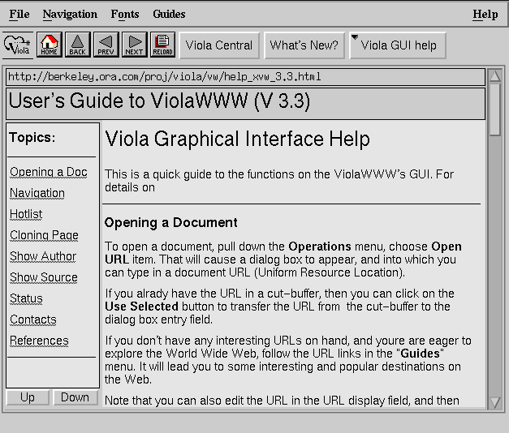
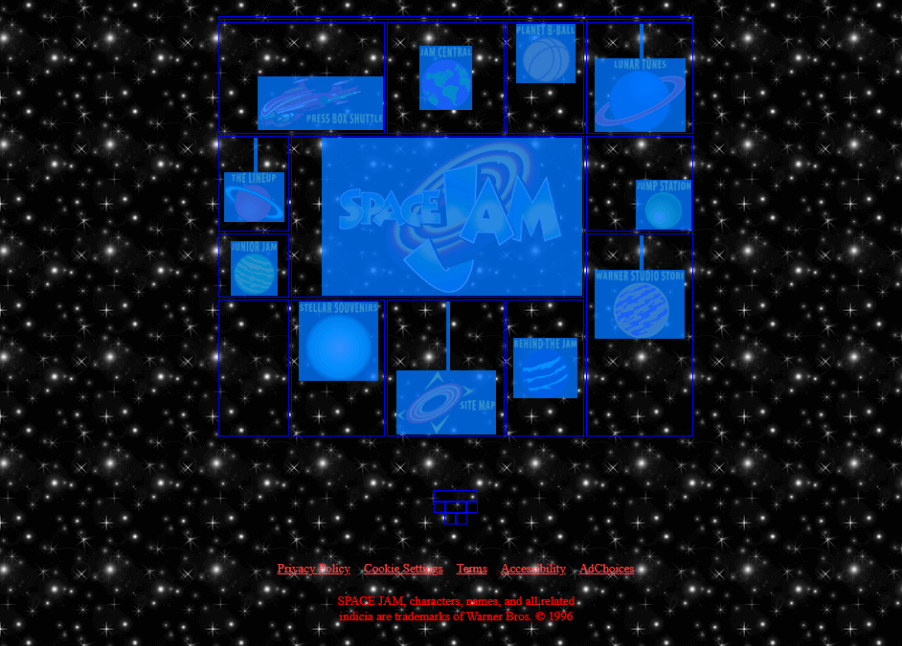
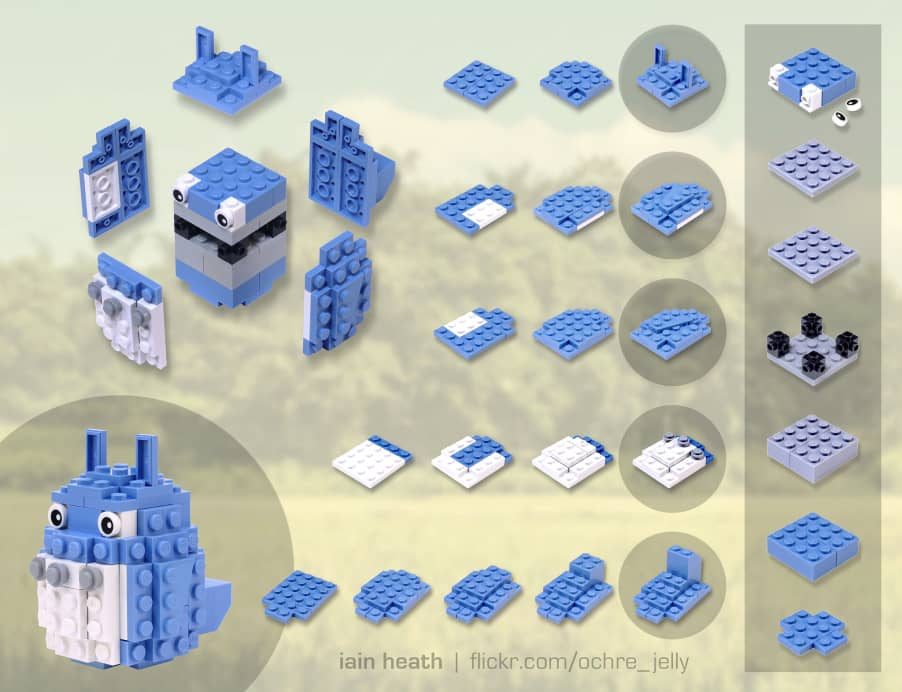
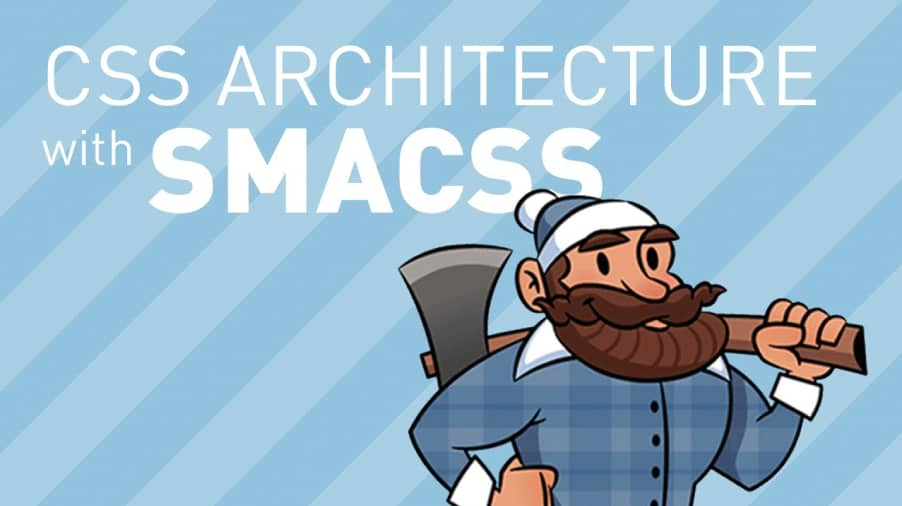
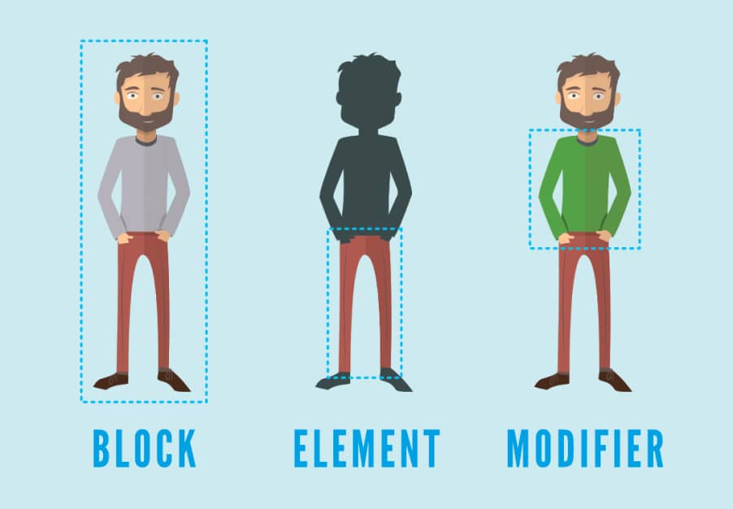
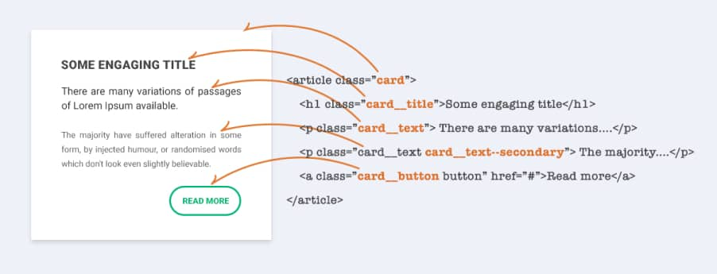
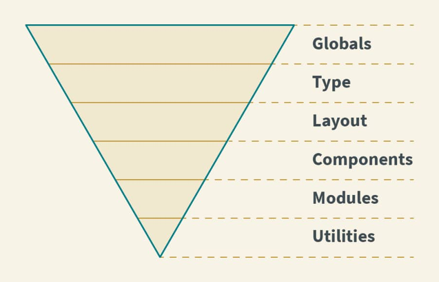

How do you work effectively with CSS so that you feel comfortable with every modification? In this article, you will find a very brief overview of the development of CSS writing and description of the most common problems.

<h2 id="a-little-history">A little history</h2>

In 1994, <strong>Håkon Wium Lie</strong> realized that there was a need to create a language that would create ways to visually edit documents on the web. The main idea was based on the need to separate the content from the presentation. Lie, together with other designers, created the first version of CSS, which over time was implemented by all browsers. After HTML, CSS became the second standardized language for W3.

This <a href="http://1997.webhistory.org/www.lists/www-talk.1994q1/0648.html">archived e-mail communication shows</a> the origins of the idea of visual editing of HTML documents. As you can see, after pasting the same HTML, the content was displayed differently on two different browsers (Netscape and Mosaic). The developers of the Mosaic browser  decided to add an indent from above before the list (now known as an unordered list). They just thought it would look better. Everyone then perceived it as a bug and this resulted in the need to have control over how their content appeared on the web.

<figure>
  
  <figcaption>Source <a href="https://en.wikipedia.org/wiki/ViolaWWW" tabindex="-1">Wikipedia</a></figcaption>
</figure>

In the mid-1990s, when the first websites began to appear, differentiating from the default browser display settings was a real challenge. At a time when cascading styles were still being tested, it was only possible to modify the design using HTML attributes. However, the first web browsers like <strong>ViolaWWW</strong> did not allow you to adjust the visual appearance almost at all.

<h2 id="what-came-before-css">What came before CSS</h2>

In the 1990s, website designers began to make the first attempts at what we now call web design. A common example of a 90's site is the <a href="https://www.spacejam.com/1996/">Space Jam site</a>. The site of the famous <strong>WarnerBros</strong> animated film is still online in its original state after 24 years; it is still possible to go through and explore it.

It is interesting to see on this website how color and text differentiation was approached in this era and how the layout was organized.

All colors are defined in the body of the page, where the creators set the basic rules for the display using HTML attributes. Specifically, the attributes bgcolor, text, link, vlink and alink. The attributes defined in this way then made it possible to display the colors of texts, links, and backgrounds differently.

<pre class="language-markup" tabindex="-1">
<code class="language-markup">

</code>
</pre>

Another nice example on this site is the layout. At the time, it was modified only  with the help of one or more embedded tables. This technique was then used for several more years to create all web document layouts.

First for the circular layout at the time (example of the Space Jam website) and then for the <a href="https://alistapart.com/article/holygrail/">Holy Grail Layout</a>, which has been a trend in web design for many years. This spreadsheet technique is still recommended today for creating newsletters and PDFs generated using HTML, because many e-mail clients simply did not choose to change their systems.

<blockquote>
“Code newsletters like it’s still 1999”<cite><a href="https://understandinggroup.com/ia-theory/why-do-we-still-build-websites-like-its-1999" tabindex="-1">The Understanding Group</a></cite>
</blockquote>

This example shows how designers came to the result of this circular layout, which was popular at the time. Companies wanted to differentiate themselves from the competition, and so the first attempts were made to change the default visual settings.

<figure>
  
</figure>

Placing images in a circular layout was then achieved again using the attributes of tables (specifically <code>align</code> and <code>valign</code>) and also using the HTML tags <code>br</code>. This was the basis of web design for several years.

<pre class="language-markup" tabindex="-1">
<code class="language-markup">

</code>
</pre>
<h2 id="the-arrival-of-css">The arrival of CSS</h2>

The advent of cascading styles was revolutionary at the time. In 1998, Eric Meyer and his team <a href="https://meyerweb.com/eric/articles/webrev/199805.html">began to describe</a> how it is possible to implement and use cascading styles. Over time, CSS made its way to the first website and soon became the standard for website design. 

<pre class="language-css" tabindex="-1">
<code class="language-css">
 BODY {
   font-family: serif;
   background-color: silver;
 }
 H1 {
   font: x-large Verdana, sans-serif;
   color: olive;
   border-bottom: thin black solid;
 }
 TABLE {
   margin: 0;
 }
 .sidebar {
   background-color: olive;
   padding: 0.5em;
 }
 .sidebar UL LI {
   list-style-type: none;
   margin-left: 0;
   margin-right: 0.5em;
 }
 .sidebar UL LI A {
   color: #ffcccc;
 }
 .body {
   background: white;
 }
 IMG.icon {
   border: outset gray 3px;
   padding: 0;
 }
 P {
   margin: 0em 0.5em;
   text-indent: 1em;
 }
</code>
</pre>

In the beginning, it was a great revolution. There was no need to rewrite the attribute values on all pages to change the title color; one small change in cascading styles was enough.  This was a great time-saving breakthrough for developers everywhere.

<blockquote>
“Two CSS properties walk into a bar. A barstool in a completely different bar falls over.”<cite><a href="https://dev.to/theodesp/two-css-properties-walk-into-a-bar-d36" tabindex="-1">Published on the dev.to community site</a></cite>
</blockquote>

Developers started using CSS more frequently, but few had addressed the need to organize and maintain styles in any way. Writing CSS without any organization or idea for sustainability was no longer enough.

There were no ways to maintain cascading styles and manage the often inconsistent design of large sites (which in some cases continues to this day). Thus, complications began to arise.

<h2 id="problems-with-properties-of-css">Problems with properties of CSS</h2>
<figure>
  
  <figcaption>Source <a href="https://tenor.com/view/family-guy-css-open-window-annoyed-pissed-gif-12014506"tabindex="-1">tenor.com</a></figcaption>
</figure>

What complications can arise when writing CSS? Writing CSS can be a tough nut to crack, especially for beginners. On the one hand, cascading styles are very easy to understand due to their straightforwardness, but on the other hand, they are quite complicated to maintain, modify and structure. Many problems can occur. I will try to briefly describe some of them.

<h3 id="high-specificity">High specificity</h3>

Everyone who has ever worked with CSS has certainly encountered this problem. The developer receives input from the graphic designer, considers which HTML element could be used, and starts writing the selector. Developer decides to use an unordered list from which he wants to create a list with blue link colors and a font size of 20px. He will use simple selector.

Then he inserts HTML into the codebase - deep into the structure of the web, where it belongs and where it should be displayed.

<pre class="language-markup" tabindex="-1">
<code class="language-markup">

</code>
</pre>

Then he writes the following CSS:

<pre class="language-css" tabindex="-1">
<code class="language-css">
.list li a {
    font-size: 20px;
    color: blue;
}
</code>
</pre>

This is not the result he wanted. The links are red, the font is 16px and bold. He looks at DevTools and finds that the selector is already overridden by another selector that prevents the correct result from being plotted:

<pre class="language-css" tabindex="-1">
<code class="language-css">
body #content .page ul li a {
  font-size: 16px;
  color: red;
  font-weight: bold;
}
</code>
</pre>

What option does the developer have now? All that remains is to increase the specificity of the newly-created selector, modify the overridden selector or use <code>!important</code>. Of course, there are more possibilities, but in principle it is still a struggle with specificity.

Very few people make adjustments to an already-finished selector, and we know why not to do so. There is no choice but to increase the specificity by adding a <code>.list</code> class to our unordered list.

<pre class="language-css" tabindex="-1">
<code class="language-css">
body #content .page ul.list li a {
  font-size: 16px;
  color: red;
  font-weight: bold;
}
</code>
</pre>

This creates a new selector in a fixed location that can no longer be used. If you need to use it elsewhere, you have to add another piece of code.

<h3 id="nesting-hell">Nesting hell</h3>

Most developers rarely realize that CSS can be used to design web documents and applications. With the advent of the popularity of preprocessors, the writing of cascading styles has become a bit closer to a programming language (thanks to the possibility of using variables, cycles, or mixins, for example). Preprocessors also came with one novelty, and that was the immersion of selectors into each other.

<figure>
  
  <figcaption>Source <a href="https://pixabay.com/photos/stork-nest-feeding-nesting-1533297/" tabindex="-1">Pixabay.com</a></figcaption>
</figure>

The deciphering of such code and its subsequent modifications was thus in some cases almost impossible. The following code looks threatening, but it's nothing special, and we often come across something like this when refactoring CSS.

<pre class="language-css" tabindex="-1">
<code class="language-css">
.Checkbox--toggle {
  .Checkbox {
    &-input {
      &:checked {
        & + .Checkbox-label {
          @extend .Checkbox-toggle—active;
        }
      }
      &:not(:checked) {
        &:focus {
          & + .Checkbox-label {
            &::before {
              background-color: $checkbox-toggle-active-bg;
            }
          }
        }
      & + .Checkbox-label {
        background-color: $checkbox-toggle-active-bg;
      }
    }
  }
}
</code>
</pre>

What will the resulting compiled selector look like? I did not dare to publish the result of this selector, but from the following picture you can get an idea of what such outputs look like.

<pre class="language-css" tabindex="-1">
<code class="language-css">
.Checkbox-toggle--active,
.Checkbox--image .Checkbox-input:checked + 
.Checkbox-image .Checkbox-toggle,
.Checkbox--image .Checkbox-input:checked +
.Checkbox-image .Checkbox--toggle .Checkbox-label,
.Checkbox--toggle .Checkbox--image .Checkbox:checked +
.Checkbox-image .Checkbox-label,
.Checkbox--toggle .Checkbox-input:checked + .Checkbox {
  background-color: #71C5E8; 
}
.Checkbox-toggle--active::before,
.Checkbox--image .Checkbox-input:checked +
.Checkbox-image .Checkbox-toggle::before,
.Checkbox--image .Checkbox-input:checked +
.Checkbox-image .Checkbox--toggle .Checkbox::before,
.Checkbox--toggle .Checkbox--image .Checkbox:checked +
.Checkbox-image .Checkbox-label::before,
.Checkbox--toggle .Checkbox-input:checked +
.Checkbox-label::before {
  background-color: #0284FF; 
}
</code>
</pre>

Such immersion of selectors do not allow such code to appear in the preprocessor file or in the resulting CSS and should be avoided.

 It is good practice to use selector plunges up to the second level. In some situations, they can be used up to the third level. Then the code will be easy to read and won’t cause endless headaches.

<pre class="language-css" tabindex="-1">
<code class="language-css">
.button {
  padding: 10px;
  @include breakpoint(tablet) {
    padding: 8px;
  }
  &:hover {
    background: blue;
  }
  &.is-active {
    color: red;
  }
  &-icon {
    max-width: 16px;
  }
  &-text {
    font-size: 0.875rem;
  }
}
</code>
</pre>

Such code is then easily readable. The developer can immediately understand what is happening, how he can further expand the record, and how he can work with it.

<h3 id="cascade">Cascade</h3>

The order matters. Another typical mistake when writing CSS is to ignore the fact that we have to pay attention to the order in which we write selectors. This feature of CSS discourages many developers from engaging in and developing styles because they simply do not understand and cannot deal with these features.

<figure>
  
  <figcaption>
    Source <a href="https://css-tricks.com/combining-the-powers-of-sem-and-bio-for-improving-css/" tabindex="-1">Combining the Powers of SEM and BIO for Improving CSS</a>  
  </figcaption>
</figure>

When we talk about cascade, we mean a combination of the following rules: order of rules, specificity of selectors and importance of rules.

  See the Pen <a href="https://codepen.io/ondrejko/pen/dymrWgQ">
  Box Model: Border-Box</a> by Ondřej Konečný (<a href="https://codepen.io/ondrejko">@ondrejko</a>)
  on <a href="https://codepen.io">CodePen</a>.

If you look closely at the previous example, you will see that:

<ul>
<li>If the selectors of two declarations have the same weight (specificity), then the browser will use the one that is later in the code.</li>
<li>CSS order matters</li>
<li>On the other hand, the order in which the classes are listed in HTML does not matter at all.</li>
<li>Wrongly chosen order of files in the project can cause great complications</li>
<li><code>!important</code> overrides all selectors</li>
</ul>

If you add some messy organisation for CSS files, then you get a spaghetti code which would lead to a lot of troubles, errors, code duplication as new developers enters the ring over time.

This extreme dependency between the HTML structure makes the code be especially fragile: even if it’s clean, a simple mistake of a non-expert can ruined it completely.

<h2 id="methodologies-and-architectures">Methodologies and architectures</h2>

To address the inherent complexity of CSS, various types of best practices and techniques have been introduced to help you create meaningful, sustainable, and extensible code for the design of your websites and applications.

For most web design needs, there is more than one way to approach a problem. There are four methods that stand out among others when considering how to structure code and name classes.

<h3 id="oocss">OOCSS</h3>

In 2008, <a href="http://www.stubbornella.org/content/">Nicole Sullivan</a> borrowed an object-oriented design concept to provide structure to CSS. She presented her OOCSS concept at the Web Directions North lecture.

<figure>
  
  <figcaption>
    From OOCSS Web by Nicole Sullivan
  </figcaption>
</figure>

In short, this methodology defines a CSS object as a visual pattern that can be used throughout the site. It serves as a guideline  when designing reusable code that is more editable and sustainable.

OOCSS has several rules that must be followed. However, this methodology is based on two rules.

<h4>Department of appearance and structure</h4>

This rule means that you never put HTML elements in selectors. In the event of a change, the code must then be modified in two places.

<pre class="language-css" tabindex="-1">
<code class="language-css">
/* This is not allowed, it create HTML dependency */
.product-detail h2 {}
 
/* This is good approach, there is no HTML dependency */
.product-detail-heading {}
</code>
</pre>
<h4>Content and container department</h4>

This rule says that you should write selectors, regardless of the location on the page, to make them as useful as possible across the web document. In fact, it tells us to simply avoid the following selectors:

<pre class="language-css" tabindex="-1">
<code class="language-css">
/* This is not allowed, there is page location */
.hero .heading-secondary {}
 
/* This selector also break the first rule */
.page-detail h2 {}
</code>
</pre>
<h3 id="smacss">SMACSS</h3>

Scalable and Modular Architecture for CSS is a methodology and <a href="http://smacss.com/">book of the same name</a> by <a href="https://snook.ca/">Jonathan Snook</a>. The main idea of SMACSS is to categorize the CSS rules system.

<figure>
  
  <figcaption>
    From SMACSS Web by Jonathan Snook
  </figcaption>
</figure>
<h4>Base</h4>

This category includes basic settings for HTML element rules. This includes standardization and basic settings.

<pre class="language-css" tabindex="-1">
<code class="language-css">
body, form {
  margin: 0;
  padding: 0;
}
a {
  color: #039;
}
a:hover {
  color: #03F;
}
</code>
</pre>
<h4>Layout</h4>

This layer includes dimensional declarations.

<pre class="language-css" tabindex="-1">
<code class="language-css">
#header { … }
#primarynav { … }
#maincontent { … }
</code>
</pre>
<h4>Module</h4>

This is a layer for what we call reusable components. Declarations of buttons, sidebars, menus, etc. can be found here.

<pre class="language-css" tabindex="-1">
<code class="language-css">
.module > h2 {
  padding: 5px;
}
.module span {
  padding: 5px;
}
</code>
</pre>
<h4>State</h4>

A state is something that augments and overrides all other styles. These are JavaScript dependencies that can apply to layout and/or module styles too.

<pre class="language-css" tabindex="-1">
<code class="language-css">
.is-tab-active {
  background-color: white;
  color: black;
}
</code>
</pre>
<h4>Theme</h4>

This layer is optional and belongs to a separate file. This is a list of rules that change the visual appearance if you want to create a different identity for your application.

<h3 id="bem">BEM</h3>

BEM is a methodology for writing CSS, backed by developers from Russian corporations. BEM stands for Block Element Modifier, which summarizes the naming convention used and the overall approach to the organization.

<figure>
  
  <figcaption>
    Image by Jed Lehmann from article “<a href="https://www.e-accent.com/articles/2017/why-your-css-needs-bem-html/" tabindex="-1">Why your CSS needs BEM</a>”
  </figcaption>
</figure>

The main benefit of this naming convention is that the selectors of the lowest specificity are created, and due to the uniqueness of their naming, no conflicts arise. BEM is also practical to use when working on a larger team of developers because its structure is simple and easy to understand.

<figure>
  
  <figcaption>
    Image from article “<a href="https://medium.com/adalab/how-does-bem-make-your-life-easier-c93a048ece3c" tabindex="-1">How does BEM make your life easier</a>” by Alex Daughter
  </figcaption>
</figure>

There are many articles on the BEM methodology, but I recommend the article <a href="https://css-tricks.com/combining-the-powers-of-sem-and-bio-for-improving-css/">Combining the Powers of SEM and BIO for Improving CSS</a>, where author <a href="https://ryanyu.com/">Ryan Yu</a> describes the problems with the basic BEM notation.

<h3 id="itcss">ITCSS</h3>

ITCSS, or Inverted Triangle CSS, is an architecture created by <a href="https://csswizardry.com/">Harry Roberts</a> that helps organize CSS files according to certain rules. Thanks to ITCSS, you can achieve the correct classification, which allows you to write meaningful and long-term sustainable style sheets.

This style organization is best suited for work on larger projects and also for working on a team where more developers write CSS. The structure itself requires other principles and methodologies to function, but as a basis for good maintenance of files, is excellent. That being said, this architecture also works on even the smallest projects and makes sense to use anywhere.

<figure>
  
  <figcaption>
    From article “<a href="https://www.xfive.co/blog/itcss-scalable-maintainable-css-architecture/" tabindex="-1">ITCSS: Scalable and Maintainable CSS Architecture</a>” by Lubos Kmetko 
  </figcaption>
</figure>

The basic idea is to rank selectors according to a specificity that less experienced developers often struggle with. The structure is divided into 7 categories according to specificity and can be expanded and modified as needed. The basic division in the project can then have this structure:

<h4>Settings</h4>

Space for preprocessors with variables such as colors, design tokens, typography, grid.

<h4>Tools</h4>

Layer with mixins, functions, media queries.

<h4>Generic</h4>

Here we insert styles for third party libraries such as normalize, reset or any others

<h4>Elements</h4>

Selectors for bare HTML elements such as <code>h1</code>, <code>p</code>, <code>article</code>, <code>a</code>.

<h4>Objects</h4>

Class definitions for layout, grid, indentation - reusable non-decorative styles.

<h4>Components</h4>

Specific components across the project - accordion, buttons, breadcrumbs, tooltip.

<h4>Utilities</h4>

Class utilities that are designed to affect one particular CSS property and are in most cases written with the utmost importance. Utilities and helper classes with ability to override anything which goes before in the triangle.

This methodology is much more thorough and I recommend studying it before using it. Many people understand this organizational structure inaccurately and will lose the huge benefits that ITCSS offers.

<h2 id="wrapping-up">Wrapping up</h2>

CSS has undergone a long development and thanks to continuous improvement (from the most experienced developers in the field) it still manages to improve and develop its functionality and capabilities. It thus holds a stable position next to its competition for the development of web documents and applications.

With the right methodologies, architectures, and good language skills, you can create structured notations that are easy to write, maintain, and extend.

